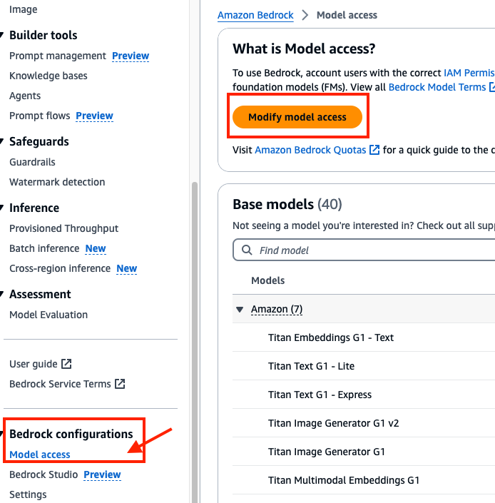

## Guidance for building generative AI assistant

## Table of Contents

1. [Overview](#overview)
    - [Architecture](#Architecture)
    - [Cost](#cost)
2. [Prerequisites](#prerequisites)
    - [Operating System](#operating-system)
3. [Deployment Steps](#deployment-steps)
4. [Deployment Validation](#deployment-validation)
5. [Running the Guidance](#running-the-guidance)
6. [Next Steps](#next-steps)
7. [Cleanup](#cleanup)

## Overview 

Every day, approximately 720,000 hours of video, 4 to 7 million blog posts are published every day across various platforms. No one can watch/read and digest all this information. Therefore concisely summarizing the content would help consumers absorb the relevant news without having to spend as much time. 
Hence, this guidance will help you build GenAI Assisant application that can help you summarizing web documents, blogs, videos, pdf, media files. You can also chat with the Assisant for conversation.

### Architecture

 

### How It Works

- Users can intract with application (GenAI Assistant) for chat assistance or summarization of web documents/videos, PDFs or media files (audio, video files). 
   - If user uploads a PDF document, application upload the file to Amazon Simple Storage Service(S3) and Amazon Textract job is created to extracts text from the file.
   - If user input is media file (audio or video), media file is uploaded to Amazon S3 and Amazon Transcribe jobs are created to generate transcript. 
   - If user input is web URL, application fetch transcript from the web url.
- Input transcript is sent to Amazon Bedrock foundational model as prompt.
- Amazon Bedrock generate response that is sent to User. 
- Amazon Bedrock response also sent to Amazon Polly to generate audio response.
- Users can futher chat with application to get more insights.


### Cost 

_You are responsible for the cost of the AWS services used while running this Guidance. We recommend creating a [Budget](https://docs.aws.amazon.com/cost-management/latest/userguide/budgets-managing-costs.html) through [AWS Cost Explorer](https://aws.amazon.com/aws-cost-management/aws-cost-explorer/) to help manage costs. Prices are subject to change. For full details, refer to the pricing webpage for each AWS service used in this Guidance._

### Sample Cost Table 


| AWS service  | Dimensions | Cost [USD] |
| ----------- | ------------ | ------------ |
| Amazon Bedrock | 1,000,000 input and output tokens per month  | $ 18 month |
| Amazon Elastic Compute Cloud (EC2) | on-demand t3.medium with 10gb storage per month| $ 31.17 month|
| Amazon Simple Storage Service (S3) Standard | 1 GB storage with 1000000 PUT and GET requests per month  | $ 5.42 month |
| Amazon Transcribe | 1000 minutes process in batch by standard Amazon Transcribe per month| $ 24.00 month|
| Amazon Textract | 1000 pages with text detection per month  | $ 1.50 month |
| Amazon Polly | 1000 requests with 1000 characters per request per month| $ 4.00|

*pricing as of Octobor 2024

## Prerequisites
### Operating System 
These deployment instructions are optimized to best work on Linux. Deployment in another OS may require additional steps.

### AWS account requirements 
-   You must have AWS account to deploy this solution.
-   [Amazon Simple Storage Service(S3) bucket](https://docs.aws.amazon.com/AmazonS3/latest/userguide/create-bucket-overview.html) to stage pdf, media files.
-   In your AWS account, request access for Foundational Model _anthropic.claude-3-sonnet-20240229-v1:0_ on Amazon Bedrock.

 
 
 
 


## Deployment Steps


1. Download [AWS CloudFormation template](guidance-for-genai-assistant.yaml) from the GitHub repository and deploy the CloudFormation stack.
 
2. The CloudFormation stack deploys an Amazon EC2 instance, GitHub repository for GenAI-Assistant and other pre-requisites required for this Guidance.


## Deployment Validation 

* Open CloudFormation console and verify the status of the CloudFormation stack. It should have CREATE_COMPLETE status. 


## Running the Guidance 

1. In the [AWS Console](https://aws.amazon.com/console/), navigate to  Amazon CloudFormation  and select CloudFormation stack deployed as part of this guidance. Navigate to 'resources' tab.
 
2. Click on the Amazon EC2 instance URL. On Amazon EC2 console, select the instance and click on connect. 
 

3. Connect to EC2 instance.
 

4. Navigate to guidance-for-genai-assistant directory and validate repository files. Review requirements.log file to make sure no errors during installation of required binaries.
```sql
cd guidance-for-genai-assistant
cat requirements.log
```
 

5. Open env.py file in the guidance-for-genai-assistant directory and update with your AWS Region and Amazon S3 bucket information.
```sql
vi env.py
```

4. Start streamlit application 

```sql
source ./venv/bin/activate
streamlit run home.py --server.port 8080
```
 

## Usage

**ChatBot**

 

**Web document, YouTube videos or blogs summarization & chat**
 
 

**Media file (audio or video )  summarization & chat**
 

**PDF documents  summarization & chat**
 
   
## Next Steps

In this guide we are using Amazon Bedrock with foundational model _anthropic.claude-3-sonnet-20240229-v1:0_. You can build on top of this solution and make it more customzied for your requirements. Also try [other models available on Amazon Bedrock](https://docs.aws.amazon.com/bedrock/latest/userguide/models-supported.html) and review [AWS solution library](https://aws.amazon.com/solutions/) for more focused solutions.

## Cleanup

When no longer needed, you can delete the resources manually or by deleting the entire AWS CloudFormation stack.

- If you want to delete the entire stack using the CloudFormation console:
    - Sign in to the AWS CloudFormation console
    - Select the Stack GenAI-Assistant and click on delete.

## Notices

Customers are responsible for making their own independent assessment of the information in this Guidance. This Guidance: (a) is for informational purposes only, (b) represents AWS current product offerings and practices, which are subject to change without notice, and (c) does not create any commitments or assurances from AWS and its affiliates, suppliers or licensors. AWS products or services are provided “as is” without warranties, representations, or conditions of any kind, whether express or implied. AWS responsibilities and liabilities to its customers are controlled by AWS agreements, and this Guidance is not part of, nor does it modify, any agreement between AWS and its customers._

## License
This library is licensed under the MIT-0 License. See the LICENSE file.

## Author

- Ravi Mathur

## Contribution

This repository is intended for educational purposes and does not accept further contributions. Feel free to utilize and enhance the app based on your own requirements.
